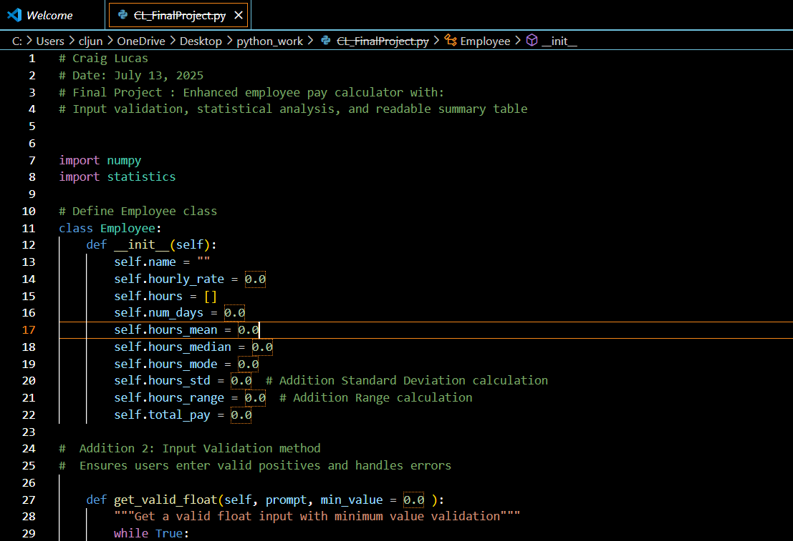
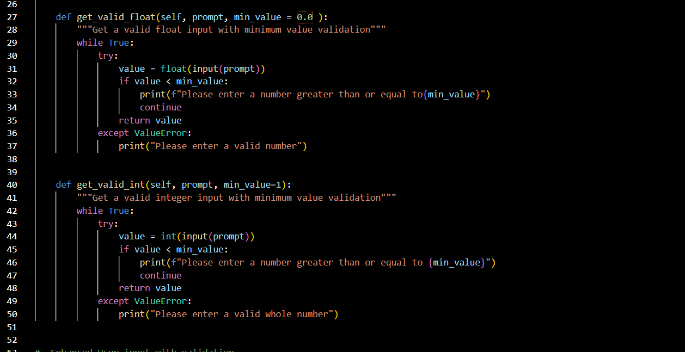
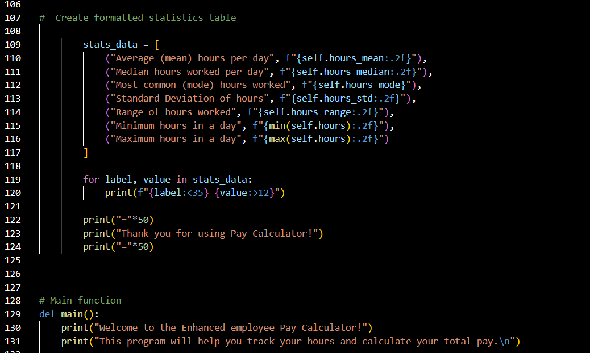
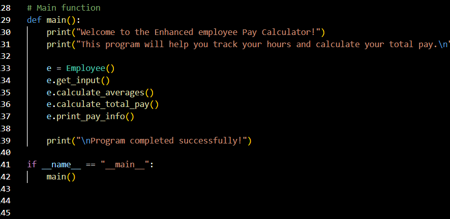
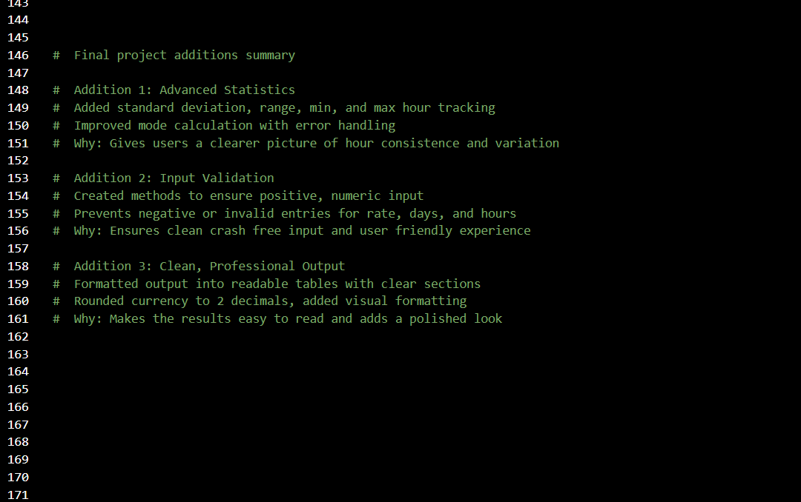
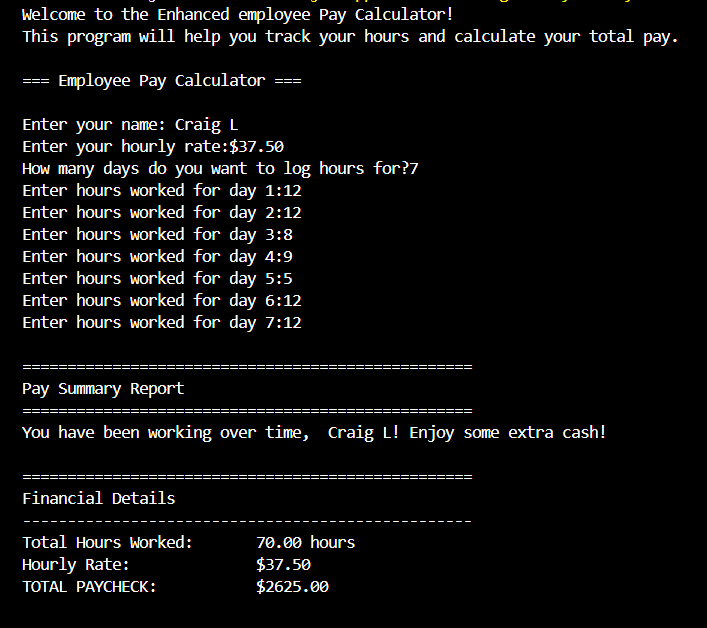
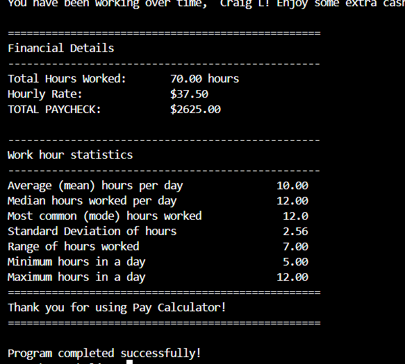

# 🧮 Employee Pay Calculator

**Author:** Craig Lucas  
**Date:** July 13, 2025

---

## 📌 Overview

This Python-based employee pay calculator collects work hours, validates inputs, and provides a detailed pay summary. It features statistical insights and professional output formatting for clarity and usability.

---

## ✅ Features

### 1. Advanced Statistics
- Calculates mean, median, and mode
- Includes standard deviation, range, min, and max

### 2. Input Validation
- Ensures all inputs are positive numbers
- Handles invalid input with user-friendly error messages

### 3. Professional Output
- Outputs a clean, formatted pay report
- Rounds and aligns values for polished presentation

---
## 📸 Screenshots & Explanations

### 🧠 Code Walkthrough

#### `calculator_pt1.png` – Project Header and Class Variables  
Initializes user data, statistical metrics, and total pay variables.



---

#### `calculator_pt2.png` – Input Validation Methods  
Defines reusable methods to validate float and integer input.



---

#### `calculator_pt3.png` – Validated User Input  
Prompts user for name, rate, and daily hours with input safeguards.


---

#### `calculator_pt4.png` – Statistical Calculations  
Calculates averages and additional stats like standard deviation and range.


---

#### `calculator_pt5.png` – Table Output Formatting  
Displays results in a structured table using consistent formatting.



---

#### `calculator_pt6.png` – Program Execution Flow  
Main function that ties together all functionality.



---

#### `calculator_pt7.png` – Summary of Enhancements  
Documents and explains the three major additions made to the program.



---

### 🖥️ Terminal Demo

#### `terminal_1.png` – User Input Session  
Example of a complete run, including name, rate, and hours logged.



---

#### `terminal_2.png` – Final Output Summary  
Displays a pay summary with total earnings and detailed hour statistics.



## 🚀 How to Run

```bash
python CL_FinalProject.py


